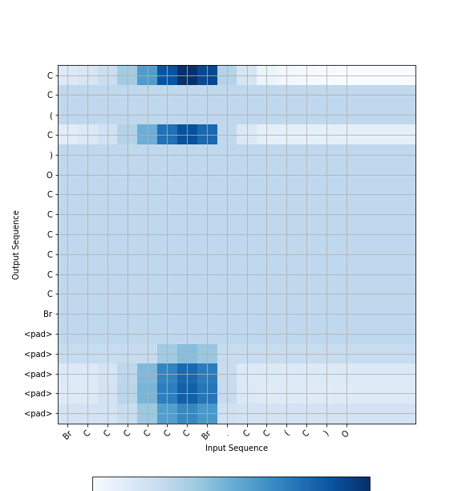
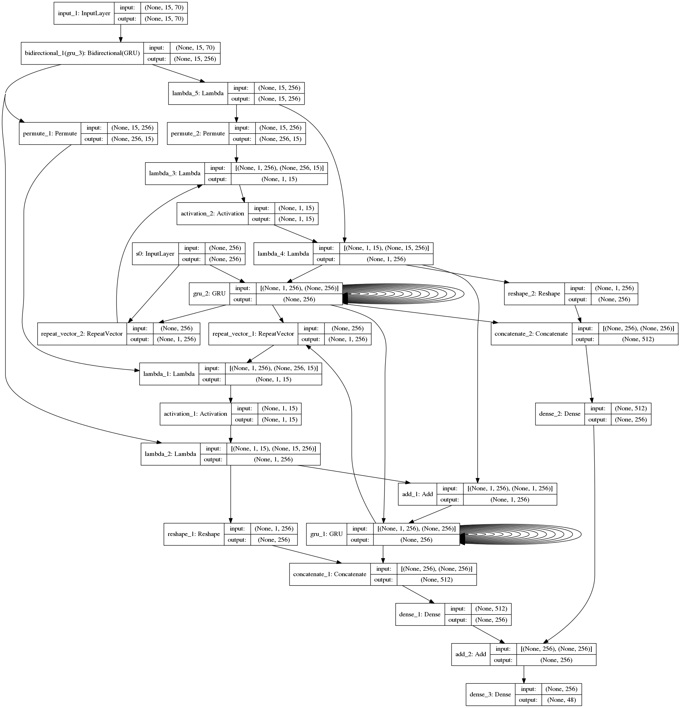
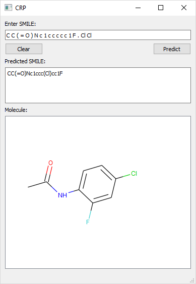

## Organic Chemistry Reaction Prediction using NMT with Attention

The intend is to solve the forward-reaction prediction problem, where the reactants are known and the interest is in generating the reaction products. The idea of relating organic chemistry to a language and explore the application of state-of-the-art neural machine translation methods, which are sequence-to-sequence (seq2seq) models was explained in Schwaller, P., Gaudin, T., Lanyi, D., Bekas, C. and Laino, T., 2017. " Found in Translation": Predicting Outcome of Complex Organic Chemistry Reactions using Neural Sequence-to-Sequence Models. arXiv preprint arXiv:1711.04810.
(https://arxiv.org/abs/1711.04810)
The data used is available at https://ibm.ent.box.com/v/ReactionSeq2SeqDataset

The model in version 2 is slightly based on the model discussed in "Asynchronous Bidirectional Decoding for Neural Machine Translation" (https://arxiv.org/abs/1801.05122). 

Beam search is used for predicting reactions in SMILES format.

### Attention Mechanism

The key idea of the attention mechanism is to establish direct short-cut connections between the target and the source by paying "attention" to relevant source content as we translate. A nice byproduct of the attention mechanism is an easy-to-visualize alignment matrix between the source and target sentences.

<p align="center">

<br>
Figure 1. <b>Attention visualization</b> – example of the alignments between source
and target sentences.
</p>

### Data

Download the required data using the below code (For Python 3).

```sh
import urllib.request
url = 'https://public.boxcloud.com/d/1/XZG91j-8-qifzIRdGyZ1OyhRNWS0cpD_MEGfgrpUjf-slwxt1hb-boJ3ZrG7CxguLlU3co4HMIlFs5FM59jHdz4x_2q80XXiPjRSTQtvcqWcHK2rPAiFyuEmIdFeg6fP2zNlttFQujmxwgeQe8C3xGBlsD73fAbEpKlMJk8fZPPbDnraqSjrz3QPiMACoR1Nwbrl9NdBhvptzzoqEzJ8dZ1vrIXRYnRVgn0Vzmh-DvhC6rAL_N95xjsJOvQx3qnA7rtxiUOum0WrnUeyOj22Pkj4PHH5TrBvHjCBcMAXSQSaPM8wyUABeypxJ5gZjqaN3IvZMVj32knzan8QpE3TDQxMmV7bC-YZp-j0zgoSZKewAjRURhIirkkGmI7tfmXS8evVu8AeRpjDyIlLVmChqdqi_UQt_J7kOjzZ5BKv9LlA5jDyhLUYkjoGnQXbr7ZgSrf1Nut_ygtrYeBkJJ9s0kTmgEDml2l2W74sf6OyuFm8BIxP8b022EgKA0bPsnBJqOigi4FN18t8YlAklpA06JMywd2Acpg0BNLAmRTGnkSC3rJrU7blVUMB6k7Gn-L6Z-c6EtLj6USo3KLU_Yf5KXRLwRE4JBhEEbB12SzJGmpZIFdZTpjOCz1nIZW_pNn7ybJ7yM1DaJkNoK4Fduh_-dM1qp6iGj-qNwQFpUfZJeI-qjYUG59H4TvBClfY-bv_Z3HHW-lj5FbAQFYVypOJsRsP18wowbq-OanmfTSLoDRV3p0wNQLXXdug_kgo0mmmDYyRg89iAilyZCvwSjRsJdIGemQSaUnaaEfahOY0gcld6YrxpEhyYECeeubEDnkWc_c3N4HeT9Co5rlrv2n709uHtNrBu4ObzzMZK3xmiqU_chySiqHIhTxfUmRTkq4v6Q-jtMKInCV69H5Hm06iJhHOH6uan1VWelRfhaPbZ11mJJzOlHDkqBRtTx8AGB2gjRcikImtfLxq3_eXmte-79KYfh3_JI8mWWwHQwY6WSVna93Necqm87a5Pmfhk2m-s7zzD50QDeKdT9yNJ7FhWiturzVtPRBKTgzDPsaSdKRFUe0YGB1RS-fvKGu5b0_0Y6t4ZS3eDBBSTVoHhbjsbvfb9oaGd-MwU3UbcEJqlguMd8gVPbgPlHHx_HtZ4uM_rr1_lDL9OqCJ0vKo4jN0bBHPrjum7vJ_0ChIoBsF_fOD7vTpp2NK5at6Z7mIBLf3Rjbg7weyXwadigp5bB3njdV6Cn2IMtNL2C2FtNbl1g6OiOTtQh4g7vqbulkq/download'
csv = urllib.request.urlopen(url).read()
with open('data/US_patents_1976-Sep2016_1product_reactions_train.csv', 'wb') as fx:
    fx.write(csv)
```


### Model

<p align="center">

<br>
Figure 1. <b> Asynchronous Bidirectional Decoding</b> – Asynchronous Bidirectional Decoding for Neural Machine Translation with Attention.
</p>

### Prediction Result

| Reactants | Actual Product | Predicted Product |  T/F |
| ------ | ------ | ------ | ------ |
| N[C@@H](CS)C(=O)O.S=C=S | O=C(O)C1CSC(=S)N1 | O=C(O)C1CSC(=S)N1 | True |
| BrCCCCCCC1CC1.O=C=O | O=C(O)CCCCCCC1CC1 | O=C(O)CCCCCCC1CC1 | True |
| CCCCCC(=O)CCCCC.NO | CCCCCC(CCCCC)=NO | CCCCCC(CCCCC)=NO | True |
| N#C[S-].O=C(Cl)c1ccco1 | O=C(N=C=S)c1ccco1 | O=C(N=C=S)c1ccco1 | True |
| Cc1nccn1CCCl.[N-]=[N+]=[N-] | Cc1nccn1CCN=[N+]=[N-] | Cc1nccn1CCN=[N+]=[N-] | True |
| CCCCCC/C=C/C(=O)Cl | CCCCCC/C=C/C=O | CCCCCC/C=C/C=O | True |
| CCCCCC/C=C/C=O | CCCCCC/C=C/CO | CCCCCC/C=C/CO | True |
| COC(=O)C(N=[N+]=[N-])OC | COC(N=[N+]=[N-])C(=O)O | COC(N=[N+]=[N-])C(=O)O | True |
| COC(=O)CO.COCCl | COCOCC(=O)OC | COCOCC(=O)OC | True |
| CNO.Nc1cccnc1.O=N[O-] | C[N+]([O-])=NNc1cccnc1 | C[N+]([O-])=NNc1cccnc1 | True |

### Graphical User Interface

A simple Graphical User Interface designed using pyqt which takes simplified molecular-input line-entry system (SMILES) as an input and generates the product SMILE & molecule.

<p align="center">

<br>
Figure 2. Graphical User Interface for Reaction Prediction
</p>

### Binaries

Executable files for Windows (64 bit) & Linux (64 bit) are available from Sourceforge.

- Linux (https://sourceforge.net/projects/crp-chemicalreactionprediction/files/CRP_GUI.tar.gz/download)
- Windows (https://sourceforge.net/projects/crp-chemicalreactionprediction/files/CRP_GUI.exe/download)

### Source Code for GUI

Source code is available in the GUI/Scripts folder.
